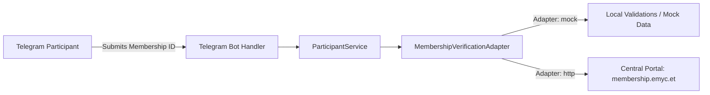

# EMYC Membership Portal API Contract Specification

This document details the external API integration contract between the **EMYC Telegram Competitive Exam Platform** and the central **EMYC Membership Portal** (`https://membership.emyc.et/`).

---

## 1. Overview & Architecture

To participate in EMYC competitive examinations, participants must be verified members of the Ethiopian Muslim Youth Council (EMYC). 

In the Telegram bot architecture, membership verification is strictly abstracted behind the `MembershipVerificationAdapter` protocol (`app/services/membership_service.py`), ensuring complete decoupling between Telegram UX and external verification backends.



---

## 2. API Endpoints Contract

### 2.1 Verify Member Status
* **Method**: `POST`
* **Path**: `/api/v1/members/verify` (or configured via `MEMBERSHIP_API_URL`)
* **Headers**:
  ```http
  Content-Type: application/json
  Authorization: Bearer <MEMBERSHIP_API_KEY>
  X-Client-App: EMYC-Telegram-Exam-Bot
  ```

#### Request Payload:
```json
{
  "membership_id": "EMYC/12345/2026",
  "telegram_user_id": 123456789,
  "telegram_username": "brother_ahmed"
}
```

#### Successful Response (HTTP 200 OK):
```json
{
  "status": "success",
  "valid": true,
  "member": {
    "membership_id": "EMYC/12345/2026",
    "full_name": "Ahmed Mohammed",
    "status": "ACTIVE",
    "region": "Addis Ababa",
    "registered_at": "2025-08-15T09:30:00Z"
  }
}
```

#### Member Not Found (HTTP 404 Not Found):
```json
{
  "status": "error",
  "valid": false,
  "code": "MEMBER_NOT_FOUND",
  "message": "Membership ID does not exist in EMYC registry."
}
```

#### Inactive or Suspended Member (HTTP 403 Forbidden):
```json
{
  "status": "error",
  "valid": false,
  "code": "MEMBERSHIP_INACTIVE",
  "message": "Membership status is inactive or expired."
}
```

---

## 3. Security & Anti-Leakage Policies

1. **Zero-Leakage UX**:
   - The Telegram bot **never** displays regex patterns, format rules, or validation internals to users.
   - If an unverified user requests to take an exam, they are provided with a friendly message directing them to register online at `https://membership.emyc.et/`.
2. **Account Binding Integrity**:
   - Each verified `membership_id` is bound 1:1 with a unique `telegram_user_id`.
   - Re-binding an already claimed membership ID to another Telegram account is blocked by database constraints.
3. **Secret Isolation**:
   - `MEMBERSHIP_API_KEY` and credentials are stored strictly in environment variables and are never committed to version control.
